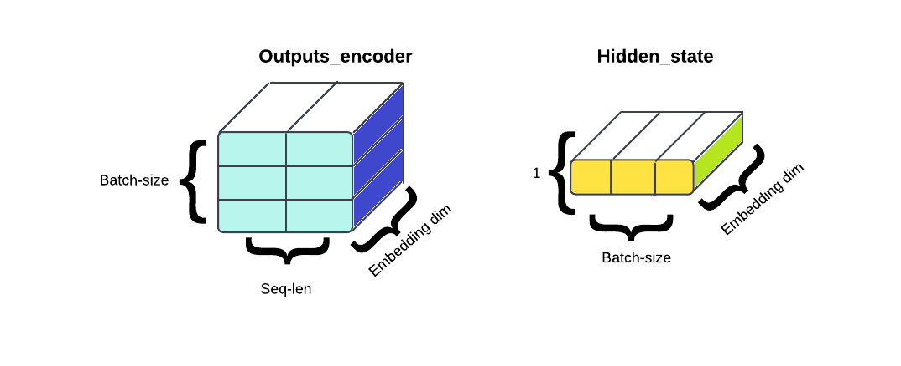
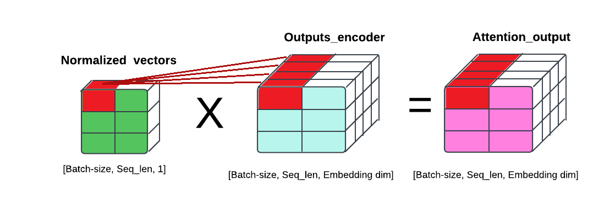

# Implementación de un mecanismo de atención en un modelo Seq2Seq con LSTMs

<div align="justify">
  
Este repositorio contiene la implementación de un modelo *Seq2Seq* Long Short-Term Memory (LSTM) y un mecanismo de atención, siguiendo los enfoques de Bahdanau y Luong. La implementación de estos mecanismos de atención mejora la capacidad del modelo para focalizarse en las partes relevantes de las secuencias de entrada, facilitando una generación de secuencias de salida más precisa y contextualizada.

## 1. Contenido

- `/attention`: Este directorio contiene la implementación del mecanismo de atención, estructurada en clases y organizada para soportar diversas operaciones de atención, tales como producto punto a punto, atención bilineal (también conocida como "atención de Luong") y atención mediante perceptrón multicapa (conocida como "atención de Bahdanau"). La Figura 1 presenta el diagrama de clases que ilustra la estructura de este módulo.

<div align="center">
  
    <p><strong>Figura 1.</strong> Diagrama de clases del módulo <i>Attention</i>.</p> 
</div>

- `/models_definition`:  Este directorio alberga la definición de los diferentes modelos: Seq2Seq con atención, incluyendo las variantes de Luong y Bahdanau. La Figura 2 presenta un diagrama de clases que proporciona una síntesis básica de estos modelos; este diagrama no contiene especificaciones detalladas.

<div align="center">
  
    <p><strong>Figura 2.</strong> Diagrama de clases de la definición de los modelos.</p> 
</div>

- `LSTM-Notebook.ipynb`: Este *notebook* implementa un modelo de traducción automática neuronal utilizando arquitecturas *Seq2Seq* con LSTM y mecanismos de atención (Bahdanau o Luong). Su objetivo es explorar y entender el funcionamiento de estos modelos mediante la carga de datos, el entrenamiento y la evaluación, además de integrar la herramienta *Weights & Biases* para el seguimiento de experimentos.
- `sanity_check.ipynb`: Este *notebook* realiza un *sanity check* del mecanismo de atención en un modelo de traducción, comprobando la forma y el cálculo de los pesos de atención para asegurar la correcta implementación de las operaciones en PyTorch.
- `translation.py`: Este archivo define una clase de dataset personalizado para tareas de traducción entre inglés y español en PyTorch, la cual carga, tokeniza, vectoriza y separa los datos de texto en conjuntos de entrenamiento y prueba, incorporando tokens especiales (`<sos>`, `<eos>`, `<pad>`, `<unk>`) y adaptando el tamaño de secuencias mediante padding para facilitar el procesamiento en los modelos.

## 2. Mecanismo de atención

En este apartado se describe en detalle el funcionamiento del mecanismo de atención implementado en los *decoders*, explicando cada paso del proceso. Para calcular la atención, es fundamental disponer del *hidden state* del *decoder* y de los *outputs* del *encoder* correspondientes a cada una de las palabras de entrada. A continuación, se presenta un caso simplificado para realizar el cálculo de la atención, donde la dimensión del *embedding* es de 4, la longitud de la secuencia es de 2, y el tamaño del *batch* es de 3.

**Paso 1**. Determinar las dimensiones de entrada. En este caso:
   - La dimensión de los *outputs* del *encoder* está representada por `[batch, seq_len, embedding_dim]`.
   - La dimensión del *hidden state* del *decoder* está representada por `[1, batch, embedding_dim]`.
   
Estas dimensiones se ilustran a continuación para proporcionar un contexto más claro sobre la estructura de los tensores involucrados en el cálculo de la atención.

<div align="center">
  
</div>

**Paso 2**. Para permitir la multiplicación de ambas matrices en el cálculo de la atención por producto escalar (*score attention*), es necesario ajustar las dimensiones del *hidden state* del *decoder* para que sean compatibles con las dimensiones de los *outputs* del *encoder*. Este proceso asegura que ambos tensores puedan multiplicarse correctamente, facilitando el cálculo de los pesos de atención.

```python
h_t = hidden_state.squeeze(0)
h_t = h_t.unsqueeze(2)
score = torch.bmm(encoder_states, h_t)
```
<div align="center">
  
</div>

Esta ilustración muestra el proceso de obtención de cada componente de atención. Por ejemplo, el primer *score* se calcula multiplicando el primer *output* del *encoder* por el *hidden state* del *decoder*, y así sucesivamente para cada elemento de la secuencia.

**Paso 3**. Tras calcular los *scores* de atención, es necesario normalizarlos aplicando la función *softmax* para convertirlos en una distribución de probabilidad. Antes de este paso, se ha eliminado la dimensión extra de los *scores* para asegurar la correcta aplicación de la normalización y facilitar el cálculo de los pesos de atención.

```python
attention_weights = score.squeeze(2)
normalized_vectors = torch.softmax(attention_weights, dim=1).unsqueeze(-1)
```

<div align="center">
  
</div>

**Paso 4**. A continuación, los valores normalizados obtenidos en el paso anterior se multiplican por cada uno de los *outputs* del *encoder* para ponderarlos en función de los pesos de atención. La región en rojo ilustra el resultado de la multiplicación del primer *score* por el vector de *embedding* correspondiente a la primera palabra del primer elemento en el *batch*.

```python
attention_output = normalized_vectors * encoder_states
```

<div align="center">
  
</div>

**Paso 5**. Finalmente, el vector de atención se obtiene sumando los vectores ponderados, generando así un promedio ponderado que representa la atención agregada sobre los *outputs* del *encoder*.

```python
summed_vectors = torch.sum(attention_output, dim=1, keepdim=True)
```

<div align="center">
  
</div>

**Paso 6**. A continuación, en el *decoder*, el vector de atención resultante se concatena con el vector *hidden*, integrando la información contextualizada por la atención en el estado oculto del *decoder*.

## 3. Modelos implementados

Tal y como se mencionó previamente, se ha implementado el modelo Seq2Seq con atención, Bahdanau y Luong.

</div>
