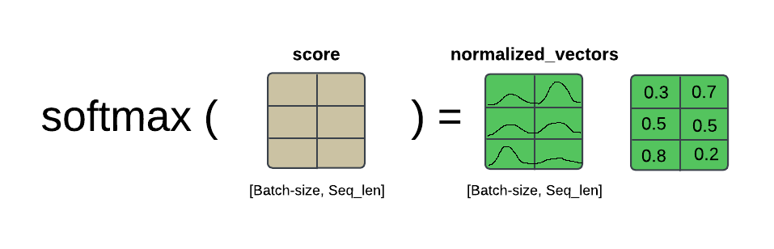

# Implementación de un mecanismo de atención en un modelo Seq2Seq con LSTMs

<div align="justify">
  
Este repositorio contiene la implementación de un modelo *Seq2Seq* Long Short-Term Memory (LSTM) y un mecanismo de atención, siguiendo los enfoques de Bahdanau y Luong. La implementación de estos mecanismos de atención mejora la capacidad del modelo para focalizarse en las partes relevantes de las secuencias de entrada, facilitando una generación de secuencias de salida más precisa y contextualizada.

## 1. Contenido

- `/attention`: Este directorio contiene la implementación del mecanismo de atención, estructurada en clases y organizada para soportar diversas operaciones de atención, tales como producto punto a punto, atención bilineal (también conocida como "atención de Luong") y atención mediante perceptrón multicapa (conocida como "atención de Bahdanau"). La Figura 1 presenta el diagrama de clases que ilustra la estructura de este módulo.

<div align="center">
  
    <p><strong>Figura 1.</strong> Diagrama de clases del módulo <i>Attention</i>.</p> 
</div>

- `/models_definition`:  Este directorio alberga la definición de los diferentes modelos: Seq2Seq con atención, incluyendo las variantes de Luong y Bahdanau. La Figura 2 presenta un diagrama de clases que proporciona una síntesis básica de estos modelos; este diagrama no contiene especificaciones detalladas.

<div align="center">
  
    <p><strong>Figura 2.</strong> Diagrama de clases de la definición de los modelos.</p> 
</div>

- `LSTM-Notebook.ipynb`: Este *notebook* implementa un modelo de traducción automática neuronal utilizando arquitecturas *Seq2Seq* con LSTM y mecanismos de atención (Bahdanau o Luong). Su objetivo es explorar y entender el funcionamiento de estos modelos mediante la carga de datos, el entrenamiento y la evaluación, además de integrar la herramienta *Weights & Biases* para el seguimiento de experimentos.
- `sanity_check.ipynb`: Este *notebook* realiza un *sanity check* del mecanismo de atención en un modelo de traducción, comprobando la forma y el cálculo de los pesos de atención para asegurar la correcta implementación de las operaciones en PyTorch.
- `translation.py`: Este archivo define una clase de dataset personalizado para tareas de traducción entre inglés y español en PyTorch, la cual carga, tokeniza, vectoriza y separa los datos de texto en conjuntos de entrenamiento y prueba, incorporando tokens especiales (`<sos>`, `<eos>`, `<pad>`, `<unk>`) y adaptando el tamaño de secuencias mediante padding para facilitar el procesamiento en los modelos.

## 2. Mecanismo de atención

En este apartado se describe en detalle el funcionamiento del mecanismo de atención implementado en los *decoders*, explicando cada paso del proceso. Para calcular la atención, es fundamental disponer del *hidden state* del *decoder* y de los *outputs* del *encoder* correspondientes a cada una de las palabras de entrada. A continuación, se presenta un caso simplificado para realizar el cálculo de la atención, donde la dimensión del *embedding* es de 4, la longitud de la secuencia es de 2, y el tamaño del *batch* es de 3.

**Paso 1**. Determinar las dimensiones de entrada. En este caso:
   - La dimensión de los *outputs* del *encoder* está representada por `[batch, seq_len, embedding_dim]`.
   - La dimensión del *hidden state* del *decoder* está representada por `[1, batch, embedding_dim]`.
   
Estas dimensiones se ilustran a continuación para proporcionar un contexto más claro sobre la estructura de los tensores involucrados en el cálculo de la atención.

<div align="center">
  
</div>

**Paso 2**. Para permitir la multiplicación de ambas matrices en el cálculo de la atención por producto escalar (*score attention*), es necesario ajustar las dimensiones del *hidden state* del *decoder* para que sean compatibles con las dimensiones de los *outputs* del *encoder*. Este proceso asegura que ambos tensores puedan multiplicarse correctamente, facilitando el cálculo de los pesos de atención.

```python
h_t = hidden_state.squeeze(0)
h_t = h_t.unsqueeze(2)
score = torch.bmm(encoder_states, h_t)
```
<div align="center">
  
</div>

Esta ilustración muestra el proceso de obtención de cada componente de atención. Por ejemplo, el primer *score* se calcula multiplicando el primer *output* del *encoder* por el *hidden state* del *decoder*, y así sucesivamente para cada elemento de la secuencia.

**Paso 3**. Tras calcular los *scores* de atención, es necesario normalizarlos aplicando la función *softmax* para convertirlos en una distribución de probabilidad. Antes de este paso, se ha eliminado la dimensión extra de los *scores* para asegurar la correcta aplicación de la normalización y facilitar el cálculo de los pesos de atención.

```python
attention_weights = score.squeeze(2)
normalized_vectors = torch.softmax(attention_weights, dim=1).unsqueeze(-1)
```

<div align="center">
  
</div>

**Paso 4**. A continuación, los valores normalizados obtenidos en el paso anterior se multiplican por cada uno de los *outputs* del *encoder* para ponderarlos en función de los pesos de atención. La región en rojo ilustra el resultado de la multiplicación del primer *score* por el vector de *embedding* correspondiente a la primera palabra del primer elemento en el *batch*.

```python
attention_output = normalized_vectors * encoder_states
```

<div align="center">
  
</div>

**Paso 5**. Finalmente, el vector de atención se obtiene sumando los vectores ponderados, generando así un promedio ponderado que representa la atención agregada sobre los *outputs* del *encoder*.

```python
summed_vectors = torch.sum(attention_output, dim=1, keepdim=True)
```

<div align="center">
  
</div>

**Paso 6**. A continuación, en el *decoder*, el vector de atención resultante se concatena con el vector *hidden*, integrando la información contextualizada por la atención en el estado oculto del *decoder*.

## 3. Modelos implementados

Tal y como se mencionó previamente, se ha implementado el modelo Seq2Seq con atención, Bahdanau y Luong. En el presente apartado, se ecxplicará cada una de las arquitecturas.

### 3.1. Modelo Seq2Seq

La arquitectura *sequence-to-sequence* (seq2seq) con *mecanismo de atención* es un modelo cuyas componentes principales son las siguientes: 

1. **Codificador (Encoder)**: El codificador es una red neuronal recurrente (LSTM) que recibe la secuencia de entrada (por ejemplo, una oración en el idioma original) y la convierte en una representación de contexto, que captura la información clave de la secuencia. Cada palabra de la secuencia se procesa en pasos sucesivos, generando un conjunto de *estados ocultos*.

2. **Decodificador (Decoder)**: El decodificador es otra red neuronal recurrente que genera la secuencia de salida (como la oración traducida). Sin embargo, en lugar de depender únicamente de la última representación del codificador, el decodificador utiliza el mecanismo de atención para acceder a todas las representaciones del codificador en cada paso de la generación.

3. **Mecanismo de Atención**: Este es el componente que permite al decodificador “atender” o enfocarse en diferentes partes de la secuencia de entrada en cada paso. El mecanismo de atención calcula un puntaje de relevancia para cada palabra de la entrada, según el estado actual del decodificador. Estos puntajes se convierten en pesos (distribución de atención), que se usan para crear un *vector de contexto* —una combinación ponderada de los estados del codificador relevantes en ese paso.

<div align="center">
    
    <p> <Strong> Arquitectura del modelo Seq2Seq. </Strong>
        Figura tomada de 
        <a href="https://www.researchgate.net/publication/329464533_Neural_Abstractive_Text_Summarization_with_Sequence-to-Sequence_Models" target="_blank">
            Neural Abstractive Text Summarization with Sequence-to-Sequence Models
        </a> 
        por Tian Shi, Yaser Keneshloo, Naren Ramakrishnan, Chandan K. Reddy. DOI: 
        <a href="https://doi.org/10.48550/arXiv.1812.02303" target="_blank">
            10.48550/arXiv.1812.02303
        </a>.
    </p>
</div>

### 3.2. Modelo de Bahdanau

El modelo Bahdanau introduce mejoras importantes en la arquitectura seq2seq, especialmente en el uso del mecanismo de atención y el codificador bidireccional. Los principales componentes y modificaciones son los siguientes:

1. **Codificador bidireccional**: Para capturar de manera más completa la información contextual de cada palabra en la secuencia de entrada, el modelo Bahdanau emplea un codificador bidireccional. Este codificador utiliza dos redes neuronales recurrentes (LSTM): una que procesa la secuencia en la dirección "hacia adelante" (desde el inicio hasta el final) y otra en la dirección "hacia atrás" (desde el final hasta el inicio). Para cada palabra de la secuencia de entrada, el estado oculto resultante es la concatenación de los estados de ambas direcciones, lo que permite al modelo tener una comprensión más detallada de la relación de cada palabra con su contexto anterior y posterior.

2. **Mecanismo de atención basado en una red multi-capa perceptrón (MLP)**: El cálculo del puntaje de atención en el modelo Bahdanau se realiza mediante una red neuronal de perceptrón multicapa (MLP). Para cada paso del decodificador, el puntaje de atención se calcula aplicando esta red a los estados ocultos del codificador y el estado actual del decodificador. Esta arquitectura de MLP permite al modelo aprender relaciones complejas entre los estados de codificación y el estado de generación actual, asignando así puntajes de atención a cada palabra de la secuencia de entrada según su relevancia para el contexto de generación actual.

3. **Aplicación de atención entre los pasos del decodificador**: En cada paso del decodificador, se calcula un nuevo vector de contexto a partir de los puntajes de atención obtenidos entre el estado actual del decodificador y los estados del codificador. Este vector de contexto actualizado, junto con el estado del decodificador en ese paso, se utiliza para predecir la siguiente palabra en la secuencia de salida. Este enfoque permite que el decodificador ajuste su enfoque a lo largo de la secuencia de entrada en cada paso de generación, asegurando que cada palabra generada en la salida aproveche la información más relevante del contexto de entrada.

<div align="center">
    
    <p> <Strong> Arquitectura del modelo Bahdanau. </Strong>
        Figura tomada de 
        <a href="https://lena-voita.github.io/nlp_course/seq2seq_and_attention.html" target="_blank">
            NLP Course by Lena Voita
        </a>.
    </p>
</div>

### 3.3. Modelo de Luong

El modelo de Luong, al igual que el modelo de Bahdanau, introduce mejoras en la arquitectura *seq2seq*, con especial énfasis en el cálculo de los *scores* de atención. Similar al modelo *Seq2Seq* con atención, está compuesto por un codificador unidireccional y un decodificador, manteniendo una estructura secuencial para procesar y generar las secuencias.

Sin embargo, en el modelo de Luong, el cálculo de los *scores* de atención se realiza mediante una función bilineal. Esta función permite calcular la relevancia entre el estado oculto actual del decodificador y los estados ocultos del codificador de manera más directa. Además, el modelo utiliza una estrategia diferente para combinar el vector de atención con el estado oculto del decodificador: ambos vectores se concatenan, se multiplican por una matriz de pesos y, finalmente, se les aplica una función de activación mediante la tangente hiperbólica (*tanh*). Este proceso permite una integración más rica de la información del codificador en cada paso de generación del decodificador, mejorando así la calidad y precisión en la secuencia de salida generada.


<div align="center">
    
    <p> <Strong> Arquitectura del modelo Luong </Strong>
        Figura tomada de 
        <a href="https://lena-voita.github.io/nlp_course/seq2seq_and_attention.html" target="_blank">
            NLP Course by Lena Voita
        </a>.
    </p>
</div>

## 4. Resultados obtenidos

En primer lugar, cabe destacar que el conjunto de datos de entrenamiento constaba de apenas 9 frases, de un máximo de 3 palabras cada una, debido a la limitación de recursos disponibles. El dataset utilizado para el entrenamiento es un subconjunto muy reducido del **Europarl Corpus**, una colección multilingüe de transcripciones de las sesiones del Parlamento Europeo ampliamente utilizada en tareas de traducción automática. Por tanto, a pesar de que las pérdidas son bajas, el modelo no logra generalizar adecuadamente debido a la insuficiencia de datos.

Finalmente, las gráficas obtenidas durante el entrenamiento de los distintos modelos se presentan en las Figuras 3 y 4. En términos generales, todos los modelos alcanzan una pérdida baja durante el entrenamiento tal y como se muestra en la Figura 3.

<div align="center">
  
    <p><strong>Figura 3.</strong> Pérdida durante el entrenamiento. </p> 
</div>

Sin embargo, en el conjunto de *test*, el modelo Bahdanau es el que presenta menor sobreajuste, mientras que el modelo Luong tiende a sobreajustarse más en este conjunto de datos reducidos.

<div align="center">
  
    <p><strong>Figura 4.</strong>  Pérdida en el conjunto de <i>test</i>. </p> 
</div>

## 5. Créditos

Este trabajo fue realizado por Susana Suárez Mendoza y Mara Pareja del Pino como parte de la realización de una práctica de la asignatura Procesamiento del Lenguaje Natural impartida en el grado de Ciencia e Ingeniería de Datos de la universidad de Las Palmas de Gran Canaria. 

- [Mara Pareja](https://github.com/marapareja17)
- [Susana Suárez](https://github.com/susanasrez)

</div>
