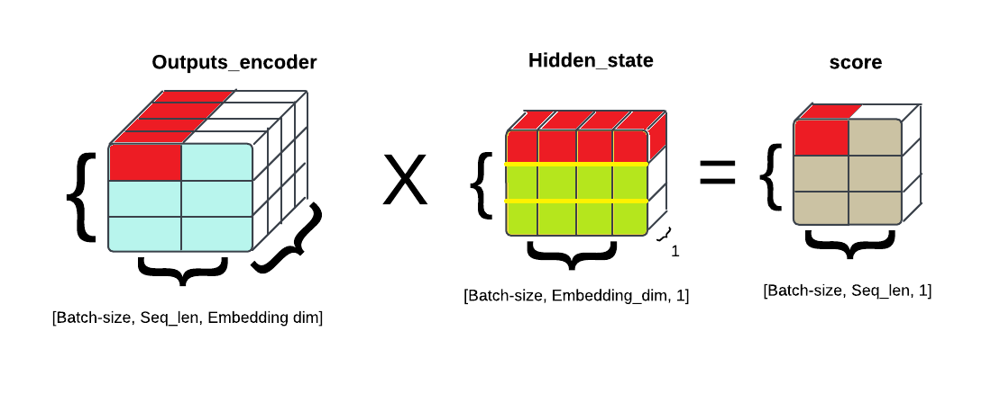

# Implementación de un mecanismo de atención en un modelo Seq2Seq con LSTMs

<div align="justify">
  
Este repositorio contiene la implementación de un modelo *Seq2Seq* Long Short-Term Memory (LSTM) y un mecanismo de atención, siguiendo los enfoques de Bahdanau y Luong. La implementación de estos mecanismos de atención mejora la capacidad del modelo para focalizarse en las partes relevantes de las secuencias de entrada, facilitando una generación de secuencias de salida más precisa y contextualizada.

## 1. Contenido

- `/attention`: Este directorio contiene la implementación del mecanismo de atención, estructurada en clases y organizada para soportar diversas operaciones de atención, tales como producto punto a punto, atención bilineal (también conocida como "atención de Luong") y atención mediante perceptrón multicapa (conocida como "atención de Bahdanau"). La Figura 1 presenta el diagrama de clases que ilustra la estructura de este módulo.

<div align="center">
  
    <p><strong>Figura 1.</strong> Diagrama de clases del módulo <i>Attention</i>.</p> 
</div>

- `/models_definition`:  Este directorio alberga la definición de los diferentes modelos: Seq2Seq con atención, incluyendo las variantes de Luong y Bahdanau. La Figura 2 presenta un diagrama de clases que proporciona una síntesis básica de estos modelos; este diagrama no contiene especificaciones detalladas.

<div align="center">
  
    <p><strong>Figura 2.</strong> Diagrama de clases de la definición de los modelos.</p> 
</div>

- `LSTM-Notebook.ipynb`: Este *notebook* implementa un modelo de traducción automática neuronal utilizando arquitecturas *Seq2Seq* con LSTM y mecanismos de atención (Bahdanau o Luong). Su objetivo es explorar y entender el funcionamiento de estos modelos mediante la carga de datos, el entrenamiento y la evaluación, además de integrar la herramienta *Weights & Biases* para el seguimiento de experimentos.
- `sanity_check.ipynb`: Este *notebook* realiza un *sanity check* del mecanismo de atención en un modelo de traducción, comprobando la forma y el cálculo de los pesos de atención para asegurar la correcta implementación de las operaciones en PyTorch.
- `translation.py`: Este archivo define una clase de dataset personalizado para tareas de traducción entre inglés y español en PyTorch, la cual carga, tokeniza, vectoriza y separa los datos de texto en conjuntos de entrenamiento y prueba, incorporando tokens especiales (`<sos>`, `<eos>`, `<pad>`, `<unk>`) y adaptando el tamaño de secuencias mediante padding para facilitar el procesamiento en los modelos.

## 2. Mecanismo de atención

En este apartado se explica en profundidad el funcionamiento del mecanismo de atención implementado y utilizado en los *decoders* paso por paso. Para calcular la atención es necesario disponer del *hidden state* del *decoder* y los *outputs* del *encoder* de cada una de las palabras de entrada. Se plantea un caso simple para realizar el cálculo de la atención donde las dimensiones del *embedding* son 4, la longitud de la frase son 2 y el tamaño del *batch* es de 3.

**Paso 1**. Conocer las dimensiones de entrada. En este caso la dimensión del output viene dada por [batch, seq_len, embedding_dim] mientras que el hidden viene dada por [1, batch, embedding_dim], tal y como se ilustra a continuación.

<div align="center">
  
</div>

**Paso 2**. Para poder multiplicar ambas matrices, en el caso del producto escalar como *score attention*, es necesario modificar el *hidden state* y modificar sus dimensiones para que sean compatibles con los *outputs* del *encoder*.
```python
h_t = hidden_state.squeeze(0)
h_t = h_t.unsqueeze(2)
score = torch.bmm(encoder_states, h_t)
```
<div align="center">
  
</div>

En esta ilustración muestra como se obtiene cada componente. Por ejemplo el primer score se obtiene multiplicando el primer *output* por el *hidden*, y asi suscesivamente.

**Paso 3**. Una vez obtenidos los *scores* de la atención, es necesario normalizar los scores pasándolos por una *softmax* para obtener una distribución de probabilidad. Aunque, previamente se ha eliminado la dimensión sobrante de los *scores*.

```python
attention_weights = score.squeeze(2)
normalized_vectors = torch.softmax(attention_weights, dim=1).unsqueeze(-1)
```

<div align="center">
  
</div>

</div>
